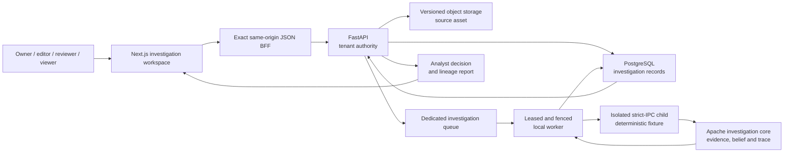
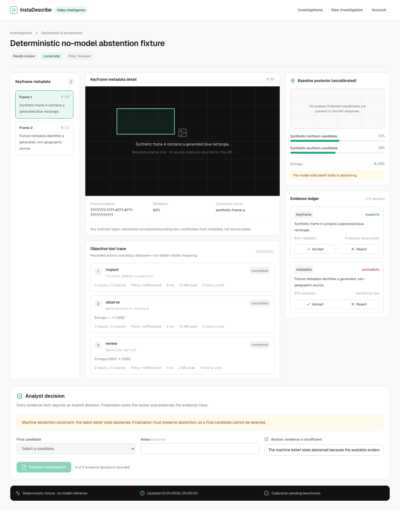

# InstaDescribe — Observable Video Intelligence

Local-first infrastructure for turning permitted public video into
evidence-backed location and provenance hypotheses that an analyst can inspect,
challenge and finalize.

[](https://github.com/AndriiArtemenko3/instadescribe/actions/workflows/ci.yml)
[](./LICENSE)
[](./packages/investigation-core/LICENSE)
[](./LICENSING.md)

> **Foundation status:** the repository implements the local
> `geolocateProvenance` investigation contract and a deterministic, no-model
> end-to-end fixture. The fixture crosses the Browser API, versioned upload,
> dedicated queue, fenced worker, isolated child process, persistence and analyst
> report boundary. The authenticated Next.js workspace now exposes that boundary
> through list, create, evidence review and report routes, with a synthetic browser
> fixture visibly marked as no-model inference. Neither fixture calls a vision
> model or the public web. Live multimodal inference, connected retrieval,
> persisted replay and public quality metrics remain separate, gated milestones.

[Investigation architecture](./docs/investigation-architecture.md) ·
[Current platform architecture](./docs/architecture.md) ·
[Decision record](./docs/adr/0011-observable-video-intelligence.md) ·
[Open investigation core](./packages/investigation-core/README.md) ·
[Licensing](./LICENSING.md) ·
[Security](./SECURITY.md) ·
[Engineering history](./docs/engineering-history.md)

## What is implemented

InstaDescribe now has two explicit workflows. `video_investigation` is a parallel
domain, not a relabeling of the retained `audio_description` pipeline.

| Capability | Public status | Evidence in this repository |
|---|---|---|
| Open investigation baseline | Implemented | Typed source, evidence, belief, trace and strict-IPC contracts; correlation-aware fusion; entropy and abstention; heuristic frame ranking; local media inspection; JSONL trace export and evaluation primitives |
| Investigation persistence | Implemented | Tenant-scoped Investigation, SourceRecord, EvidenceItem, InvestigationStep, BeliefSnapshot and AnalystDecision records, with source retention metadata and immutable media SHA-256 after validation |
| Browser investigation API | Implemented | Create/list/get/cancel, upload completion, evidence/keyframe/step/belief reads, analyst finalization and report retrieval for `geolocateProvenance + local` |
| Isolated execution path | Implemented | A dedicated investigation queue, worker leases and fencing, cancellation/reclaim behavior, a workspace-root-scoped host-local file lease and a bounded `python -I` child result boundary |
| Supportive and abstaining journeys | Implemented as deterministic fixtures | Both paths cross FastAPI, direct versioned storage, SQS-compatible transport, the real worker and durable report state without model or public-web calls |
| Analyst investigation workspace | Implemented and fixture-verified in source | Authenticated list/create/workspace/report routes; direct upload orchestration; role-aware controls; source lineage, keyframe metadata, evidence state, uncalibrated posterior, entropy, abstention and objective tool ledger |
| Live local multimodal inference | Gated next | Loopback adapter code is not an accepted end-to-end capability; the worker fails closed until a parent-validated proposal handshake and runtime/resource gates are complete |
| Connected retrieval and geometric verification | Not implemented | No crop leaves the local boundary and no connected result can be presented as verified evidence |
| Persisted replay | Not implemented | A committed deterministic fixture is test infrastructure, not persisted trace replay |
| Investigation benchmark | Not reported | There are no public accuracy, calibration, retrieval, latency or memory claims |

## Implemented investigation flow



The creation contract is deliberately narrow: `geolocateProvenance` with `local`
connectivity. Unsupported investigation kinds or connectivity policies return
`422 investigation_mode_unavailable` instead of entering a partial pipeline. The
stable Integration API, SDK and CLI do not expose investigation jobs or commands.

The BFF accepts only the ten implemented investigation method/path pairs. It
rejects wrong methods, malformed identifiers, arbitrary nested resources and
egress paths before contacting FastAPI. Browser responses are parsed as exact,
bounded shapes; unknown fields and internally inconsistent belief or decision
states fail closed.

Here, `local` means that the investigation authorizes no public-internet retrieval.
PostgreSQL, S3-compatible storage and SQS-compatible transport remain explicit
infrastructure boundaries. The deterministic acceptance fixture makes no model or
public-web request.

## Evidence, belief and analyst control

The baseline keeps observations separate from conclusions. Evidence records retain
their source/artifact identity, timecode, optional crop coordinates, reliability,
verification state, polarity and correlation group. The belief engine counts a
correlation group once; the current adapter conservatively groups observations from
the same selected frame. Cross-frame deduplication of the same physical clue is not
implemented.

The transparent baseline is:

$$
z_h = \log \pi_h + \sum_g w_g s_g(h)
$$

$$
p(h \mid E) = \mathrm{softmax}(z_h / T)
$$

Belief snapshots persist ranked candidates, normalized probabilities, entropy and
an abstention decision. This posterior is not presented as calibrated: the public
`calibratedConfidence` field remains empty until a rights-cleared benchmark supports
that claim.

An analyst must accept or reject every current evidence item before finalization. A
non-abstaining report requires accepted evidence that supports a current candidate;
otherwise the analyst records an explicit abstention and reason. Accepting an item
for a report does not change its provenance-verification state.

The step trace is an objective tool and event ledger with bounded inputs, outputs,
policy decisions, digests and measured execution metadata when available. It is not
raw chain-of-thought.

## Failure behavior is part of the design

| Condition | Result |
|---|---|
| Unsupported kind or connectivity policy | Reject creation with a bounded `422`; enqueue nothing |
| Insufficient or conflicting evidence | Persist an abstaining belief state rather than manufacture a hypothesis |
| Child changes source, identity, policy, priors or belief math | Reject the result at the parent-owned IPC boundary |
| Worker loses its lease, is cancelled or becomes stale | Fencing prevents evidence or state publication |
| Live runtime lacks the required trust handshake | Fail closed before launching the child |
| Foreign or missing tenant identifier | Resolve through the same organization-scoped absence boundary |

## Run the open baseline

Prerequisites: Python 3.12, `uv`, `make` and Node.js.

```bash
make investigation-core-check
```

This locked gate runs Ruff, the standalone package tests, wheel/sdist build,
distribution verification and the nested-license boundary check. For a minimal
offline runner and JSONL trace example, see
[packages/investigation-core/README.md](./packages/investigation-core/README.md).

The full Browser-to-report fixture is an integration acceptance test that requires
the repository's disposable PostgreSQL and LocalStack environment. Its exact,
reviewable journey is in
[services/worker/tests/test_investigation_e2e_acceptance.py](./services/worker/tests/test_investigation_e2e_acceptance.py).
It is test evidence, not a model-quality demo or a deployment claim.

The analyst workspace has a separate synthetic Playwright journey on desktop and
mobile Chromium:

```bash
npm ci
npm run build:next -w App
npm run test:e2e -w App
```

It exercises bounded deep links, list/create, direct upload, all four human roles,
keyframe metadata, evidence-state presentation, abstention/finalization, report and
the retained legacy route. The representative upload is intercepted and unexpected
external requests are blocked.



This capture is generated from reserved identifiers and synthetic observations. It
contains no account or customer data, no source pixels and no model output. The one
synthetic `verified` metadata item exists to exercise the UI's proposed/verified
contract distinction; the worker acceptance fixtures continue to persist their
generated observations as `proposed`.

## Repository map

```text
packages/investigation-core/ Apache-2.0 evidence, belief, trace, IPC and eval baseline
services/api/                FastAPI tenancy, Browser and stable Integration APIs
services/worker/             Fenced AD workers and dedicated investigation worker
migrations/                  PostgreSQL schema, including the investigation domain
App/                         Next.js investigation workspace and retained AD editor/rollback build
packages/sdk/                MIT TypeScript client for the stable Integration API
packages/cli/                MIT CLI for the stable Integration API
packages/contracts/          Shared BUSL queue and provider contracts
modular_pipeline/            Retained audio-description media/ASR/TTS/export pipeline
openapi/                     Deterministically exported API contracts
infrastructure/              LocalStack and Terraform resource boundaries
docs/                        Architecture, ADRs, evaluation and historical evidence
```

Useful starting points for a code review:

- open contracts and belief math:
  [`packages/investigation-core/src/instadescribe_investigation_core/`](./packages/investigation-core/src/instadescribe_investigation_core/);
- Browser API contract:
  [`services/api/app/api/browser/investigations.py`](./services/api/app/api/browser/investigations.py);
- durable domain:
  [`services/api/app/models/investigation.py`](./services/api/app/models/investigation.py) and
  [`migrations/versions/0014_video_investigations.py`](./migrations/versions/0014_video_investigations.py);
- process boundary:
  [`services/worker/instadescribe_worker/investigation_executor.py`](./services/worker/instadescribe_worker/investigation_executor.py);
- supportive and abstention acceptance:
  [`services/worker/tests/test_investigation_e2e_acceptance.py`](./services/worker/tests/test_investigation_e2e_acceptance.py).
- authenticated workspace and strict browser parser:
  [`App/src/app/(product)/investigations/`](./App/src/app/%28product%29/investigations/) and
  [`App/src/lib/investigations.ts`](./App/src/lib/investigations.ts);
- desktop/mobile no-model browser journey:
  [`App/e2e/investigation-workspace.spec.ts`](./App/e2e/investigation-workspace.spec.ts).

## Mixed-license boundary

This is a public **mixed-license monorepo**, not an entirely open-source product.

| Area | License |
|---|---|
| `packages/investigation-core/**` | Apache License 2.0 |
| `packages/sdk/**`, `packages/cli/**` | MIT |
| Product shell, API, workers and remaining InstaDescribe-authored code | BUSL-1.1, subject to the exact exceptions and Change Date in the repository license documents |
| Third-party code, media, fonts and model assets | Their upstream terms |

Read [LICENSING.md](./LICENSING.md) for the exact file-level boundary. The root
BUSL license does not override the nested Apache and MIT package licenses.

## Legacy: audio description

InstaDescribe began as a human-reviewed audio-description system. That history is
preserved, including organization/RBAC foundations, direct media transfer,
asynchronous jobs, worker fencing, FFmpeg/ASR/TTS, scene review, atomic deliverables,
the stable Integration API and the MIT SDK/CLI.

The Next.js investigation routes are now the primary product workspace. The
audio-description project view remains reachable at `/legacy/audio-description`,
while the Vite editor and deterministic Sintel demo remain rollback/history
surfaces. None of those legacy surfaces is evidence that a video-investigation
model ran. See
[Architecture evolution](./docs/architecture-evolution.md) and
[Engineering history](./docs/engineering-history.md) for the migration story.

## Data, safety and limitations

- Use analyst uploads, clearly licensed or public-domain assets,
  publisher-provided material, or design-partner uploads covered by written
  permission.
- Telegram-derived scraped data is excluded from the AI pipeline and evaluation
  corpus without separate, confirmed permission.
- Raw evaluation datasets stay outside Git. Commit only redistributable fixtures,
  provenance manifests and aggregate results with documented limitations.
- Face recognition, live tracking of people or units, weapon targeting and
  operational-coordinate output for use of force are out of scope.
- A model proposal is never ground truth, and a connected result—when that boundary
  exists—must not become verified evidence automatically.
- The repository does not claim production readiness, universal geolocation,
  customer deployment, an SLA or investigation accuracy.

Issues and private security reports are welcome. See
[CONTRIBUTING.md](./CONTRIBUTING.md) and [SECURITY.md](./SECURITY.md). Do not put
sensitive footage, source identities, credentials or private datasets in a public
issue.
