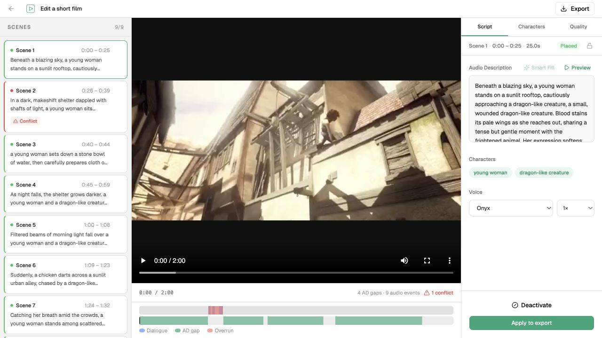
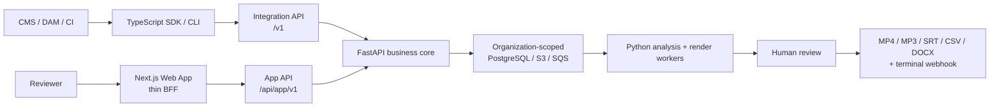

# InstaDescribe

API-first, multi-tenant workflow for creating human-reviewed audio description
and delivering accessible video assets from one asynchronous pipeline.

[](https://github.com/AndriiArtemenko3/instadescribe/actions/workflows/ci.yml)
[](./LICENSE)
[](./LICENSING.md)
[](./openapi/instadescribe-cloud-v1.json)

> **Beta status:** The API-first beta architecture is implemented in this
> repository and locally verified. The static legacy Cloud Core v0.1 frontend
> remains published, but its API/readiness is currently unavailable as of
> `2026-08-29`. Beta infrastructure cutover, live integration canaries and npm
> publication are pending.



[Architecture](./docs/architecture.md) ·
[Architecture evolution](./docs/architecture-evolution.md) ·
[Engineering history](./docs/engineering-history.md) ·
[Deterministic demo](#deterministic-demo) ·
[OpenAPI](./openapi/instadescribe-cloud-v1.json) ·
[SDK](./packages/sdk/README.md) ·
[CLI](./packages/cli/README.md)

## The product boundary

InstaDescribe turns a browser-only authoring pipeline into a service that a CMS,
DAM, CI job or university media workflow can call. FastAPI remains the only owner
of tenant isolation, quotas, idempotency and state transitions. Python workers own
media and AI processing. Node.js has three bounded roles: the authenticated Next.js
web application and thin BFF, the server-side TypeScript SDK, and the CLI.



The stable external lifecycle is:

```text
awaiting_upload → queued → processing → needs_review → rendering → completed
                                      ↳ failed / cancelled
```

Review mutations stay in the web application. An integration creates a job,
uploads directly to private S3, waits for `needs_review`, sends a reviewer to the
web UI, then consumes a terminal webhook and downloads a complete, checksummed
five-format deliverable set.

## Engineering highlights

| Concern | Design |
|---|---|
| Tenant isolation | Every Project and Job belongs to an Organization; repositories scope every read and write to the authenticated Principal, and foreign IDs resolve like absent IDs |
| Safe retries | Required idempotency keys bind a request key to its payload for 24 hours; quota and active-job capacity are reserved transactionally |
| Worker races | Database leases and fencing prevent cancelled or stale workers from publishing state or artifacts |
| Human control | Every scene receives a reviewer decision; a zero-description result requires explicit confirmation |
| Atomic delivery | MP4, MP3, SRT, CSV and DOCX remain internal until the entire checksum-verified set succeeds |
| Notifications | State transitions and immutable webhook outbox events commit in the same transaction; delivery is signed and at least once |
| Browser security | Cognito tokens stay server-side; the browser holds an opaque `__Host-` session cookie, while media transfers directly between browser and S3 |

The detailed invariants and ownership boundaries live in
[docs/architecture.md](./docs/architecture.md) and
[ADR-0010](./docs/adr/0010-api-first-b2b-beta.md).

## Deterministic demo

The committed Sintel fixture exercises the editor without an API key, cloud
account or paid provider call.

Prerequisites: Node.js 22.19 or newer.

```bash
npm ci
npm run demo -w App
```

Open the URL printed by Vite. The demo uses committed scene, transcript, poster,
audio and export fixtures; it does not upload data or call a model provider.
Sintel attribution is recorded in
[THIRD_PARTY_NOTICES.md](./THIRD_PARTY_NOTICES.md).

## Integration surface

The generated OpenAPI document is exported deterministically from FastAPI. The SDK
exposes a hand-written ergonomic boundary rather than its generated transport.

```ts
import { InstaDescribe } from "@instadescribe/sdk";

const client = new InstaDescribe({
  baseUrl: "https://api.instadescribe.example",
  appUrl: "https://app.instadescribe.example",
  apiKey: process.env.INSTADESCRIBE_API_KEY!,
});

const submission = await client.jobs.submitFile({
  filePath: "./lecture.mp4",
  transcriptPath: "./lecture.vtt",
  project: { name: "BIO101", externalId: "lecture-07" },
});

const ready = await client.jobs.wait(submission.jobId);
console.log(client.reviewUrl(ready).href);
```

Equivalent CLI flow:

```bash
printf '%s' "$INSTADESCRIBE_API_KEY" | instadescribe auth login --key-stdin
instadescribe create ./lecture.mp4 --project BIO101 --transcript ./lecture.vtt --wait
instadescribe review JOB_ID --open
instadescribe wait JOB_ID --until completed
instadescribe download JOB_ID --output-dir ./accessible
```

The SDK and CLI source are complete in this repository but are not yet published
to npm. Service keys never enter the browser or signed S3 requests.

## Implementation status

| Surface | Status |
|---|---|
| API-first beta source and local test coverage | Implemented and locally verified |
| Multi-tenant FastAPI integration and browser APIs | Implemented locally; beta deployment pending |
| Next.js App Router cutover | Implemented behind the browser cutover boundary; Vite remains the rollback build |
| TypeScript SDK and CLI | Implemented in source; npm packages unpublished |
| Public AWS Cloud Core v0.1 | Static legacy frontend published; API/readiness unavailable as of `2026-08-29`; release-time evidence is preserved separately |
| Cognito/S3/webhook/provider live canary | Pending |
| Customer beta, billing, SLA | Not started / out of beta scope |

The legacy deployment is evidence of the asynchronous AWS foundation, not a claim
that the B2B beta is deployed. Its bounded release record is preserved in the
[Cloud Core v0.1 evidence packet](./docs/releases/v0.1-cloud-core.md).
The history and privacy boundary for the future public branch is documented in
[PUBLIC_SNAPSHOT.md](./PUBLIC_SNAPSHOT.md).

## Repository map

```text
App/                Next.js web app + Vite rollback/editor build
services/api/       FastAPI business authority and public API boundaries
services/worker/    SQS consumers and isolated analysis/render execution
modular_pipeline/   Media, multimodal drafting, TTS and export pipeline
packages/sdk/       MIT-licensed server-side TypeScript SDK
packages/cli/       MIT-licensed Node.js CLI
packages/contracts/ Shared Python queue/provider contracts
openapi/            Deterministic FastAPI contract export
migrations/         PostgreSQL/Alembic schema evolution
infrastructure/     Terraform for legacy and isolated beta AWS resources
docs/               Architecture, ADRs, evaluation and runbooks
```

## Evaluation evidence

An earlier formative evaluation involved 10 student participants over two days;
9 were sighted. On a five-point scale, participants rated draft accuracy 4.4,
usefulness 4.2 and trust 4.0. The study used an eyes-closed task as a proxy and did
not involve professional describers, so it is product evidence, not a general claim
about blind-user outcomes or standards compliance. Method and limitations are in
[docs/evaluation.md](./docs/evaluation.md).

InstaDescribe is designed to support audio-description authoring workflows. The
repository does not claim legal WCAG compliance, production readiness, live B2B
customers, billing or an SLA.

## Development

Useful local gates:

```bash
npm run build
npm test
npm run typecheck
make test
make lint
```

Cloud integration tests additionally require the repository's disposable
PostgreSQL and LocalStack test environment. See the Makefile and runbooks for the
bounded commands; never point migration tests at an application database.

## Licensing and contributions

The product core is source-available under
[Business Source License 1.1](./LICENSE), with an Apache-2.0 Change Date of
`2030-08-29`. The SDK and CLI are separately open source under MIT. See
[LICENSING.md](./LICENSING.md) for the exact boundary and
[COMMERCIAL_LICENSE.md](./COMMERCIAL_LICENSE.md) for production-use inquiries.

Issues and private security reports are welcome. External pull requests are not
accepted during the beta; see [CONTRIBUTING.md](./CONTRIBUTING.md) and
[SECURITY.md](./SECURITY.md).
