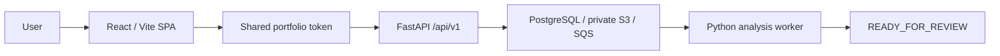
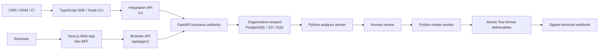
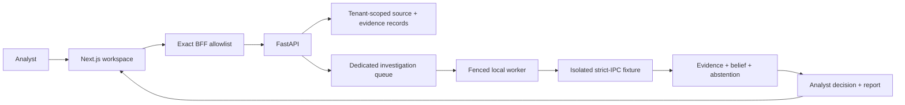

# Architecture evolution: from audio description to video investigation

This document shows the capability delta between the historically deployed Cloud
Core v0.1 and the API-first B2B beta implemented in the repository. It is a
source-architecture comparison, not a claim that the beta is already deployed.
Legacy deployment references are dated release evidence; this comparison makes no
claim about their current availability or support status.

The repository has since added a parallel Observable Video Intelligence foundation.
That milestone and its authenticated analyst workspace are implemented and
fixture-verified in source; this is not a claim that a live model pipeline or
connected service is deployed.

## Before: bounded browser workflow

Cloud Core v0.1 established direct private uploads, durable relational state,
queued container processing, signed media manifests and persisted scene edits. Its
boundary is intentionally narrow: one browser client, one shared access token,
portfolio-wide listings, analysis only through `READY_FOR_REVIEW`, and manual
capacity control.

## Now: organization-scoped integration product

## Differential

| Concern | Cloud Core v0.1 | API-first beta |
|---|---|---|
| Primary client | Vite browser application | Web App, server-side SDK, CLI and external automation |
| Identity | One server-side portfolio token | Organizations, memberships, Cognito users, service accounts and scoped API keys |
| Data isolation | Shared portfolio boundary | Required `organization_id`, principal-scoped repositories and composite tenant constraints |
| API surface | Browser compatibility API | Separate Integration API and Browser API with different credentials |
| Project semantics | Project/job compatibility shape | One Project per source and a new Job for every run |
| Retry contract | Endpoint-specific behavior | Required 24-hour idempotency for retryable writes |
| Upload | Direct, constrained S3 upload | Direct version-pinned video plus optional timed VTT/SRT upload |
| Lifecycle | Analysis to `READY_FOR_REVIEW` | Stable public lifecycle through review, rendering and completion |
| Review | Persisted scene editing | Role-enforced decisions for every scene and explicit zero-AD confirmation |
| Output | Analysis artifacts | MP4, MP3, SRT, CSV and DOCX published atomically with integrity metadata |
| Notification | Polling | Polling plus signed, replay-protected terminal webhooks |
| Worker safety | Conditional claim, bounded concurrency | Lease/fence cancellation safety, durable attempt journals and cleanup |
| Browser server | Static Vite application | Next.js App Router plus thin JSON BFF; Vite retained as rollback |
| Node.js role | Frontend tooling | Web/BFF, MIT TypeScript SDK and MIT CLI; no business-state authority |
| Deployment status | Historical AWS release evidence; no current availability or support claim | Implemented and locally verified; isolated beta cutover still pending |

## Why this is a product change

The beta does not move Python business logic into Node.js. It makes the existing
media and review pipeline addressable as a stable service. UI navigation is no
longer a prerequisite for starting work; a client can create a job, stream media
directly to storage, reconcile by external identifiers, wait for human review and
consume completed assets through a documented contract.

The web application remains essential for the judgment-heavy part of the workflow.
SDK and CLI clients can direct a reviewer to a short-lived, server-provided review
URL, but they cannot approve or mutate review decisions during beta.

## Compatibility boundary

The new `INSTADESCRIBE_*` configuration namespace is canonical. Legacy
`INSTASCRIBE_*` aliases remain only for the v0.1/Vite rollback window: old-only is
accepted with a deprecation warning, identical old/new values are accepted, and
conflicting values fail closed. Existing database names, object keys and applied
AWS/Terraform identities are not mechanically renamed.

For implementation details, see [Architecture](./architecture.md) and
[ADR-0010](./adr/0010-api-first-b2b-beta.md).

## Current parallel domain: observable video investigation

The investigation work reuses the organization, storage, queue and worker-safety
boundaries without renaming audio-description scenes into evidence.

| Concern | Audio-description workflow | Investigation foundation |
|---|---|---|
| Review unit | Scene and narration decision | Evidence item, belief snapshot and final analyst decision |
| Output | Atomic accessible-media deliverables | Source/evidence/decision lineage report JSON |
| Client surface | Browser plus stable Integration API, SDK and CLI | Authenticated Browser workspace and Browser API; stable Integration API/SDK/CLI intentionally unchanged |
| Execution proof | Deterministic editor and pipeline fixtures | Supportive and abstention Browser-to-report fixtures, no model inference |
| Network posture | Configurable AD providers | Investigation creation currently accepts only `local`; retrieval is absent |

See [Video-investigation foundation](./investigation-architecture.md) and
[ADR-0011](./adr/0011-observable-video-intelligence.md). The retained AD interfaces
remain reviewable history rather than the new product's evidence model.
