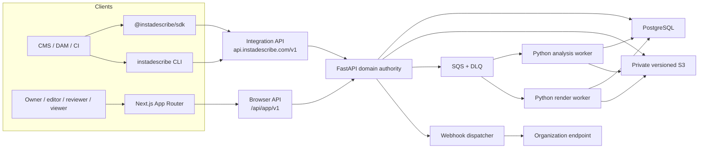
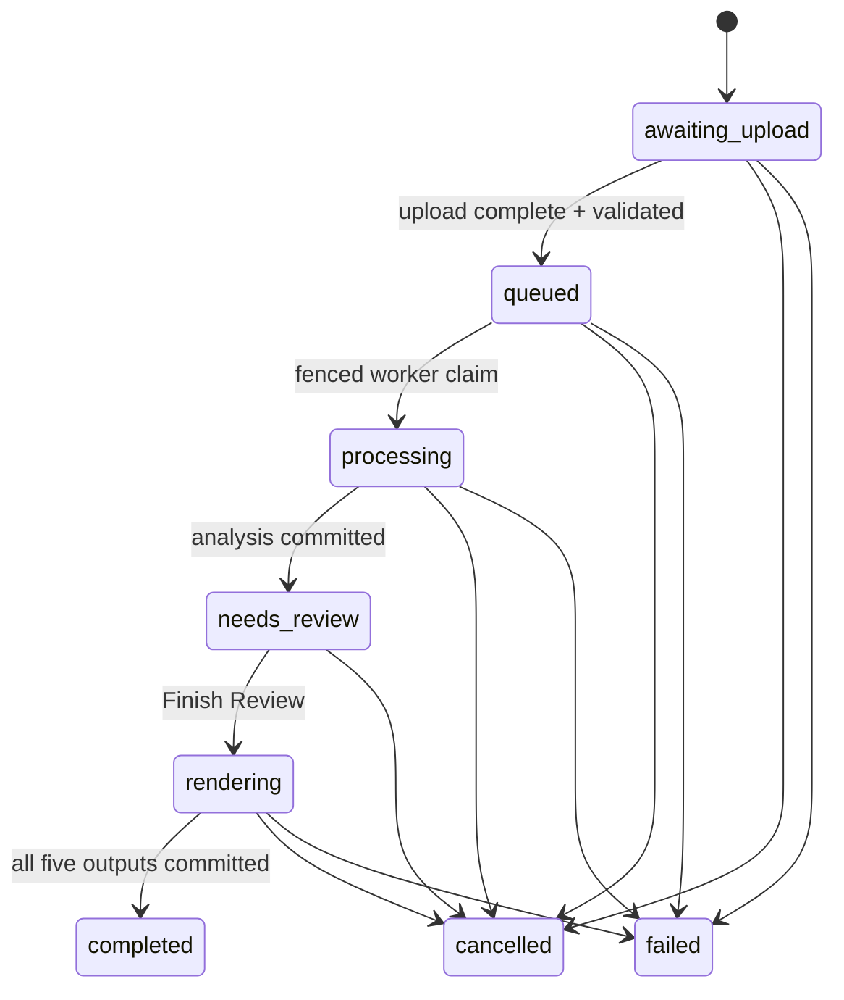

# InstaDescribe architecture

> **Status boundary:** The API-first beta described here is implemented in the
> repository and locally verified. The static legacy Cloud Core v0.1 frontend
> remains published, but its API/readiness is currently unavailable as of
> `2026-08-29`. Beta cutover, live Cognito/S3/webhook/provider canaries and npm
> publication are pending.

InstaDescribe is an asynchronous, human-in-the-loop system for producing audio
description. FastAPI is the sole business authority. PostgreSQL owns identity,
tenant boundaries and state; S3 owns versioned media bytes; SQS transports work;
Python workers perform media and AI processing. Node.js supplies clients and the web
delivery boundary without duplicating domain rules.

## System context

Media transfer bypasses both FastAPI and Next.js after authorization. Clients send
bytes directly to or from S3 through short-lived, constrained, version-pinned signed
contracts.

## Ownership boundaries

| Component | Owns | Explicitly does not own |
|---|---|---|
| FastAPI | authorization, tenancy, quotas, idempotency, public state projection, review completion, render creation, deliverable publication | media bytes, browser session storage, model execution |
| PostgreSQL | organizations, memberships, projects/jobs, leases/fences, review decisions, renders, deliverables, audit/outbox and retention journals | large media objects |
| S3 | private source, transcript, intermediate and deliverable object versions | business state or authorization decisions |
| SQS | at-least-once task transport | durable job truth |
| Python workers | validation, analysis, TTS, render and integrity calculation under a lease/fence | public lifecycle transitions without database guards |
| Next.js | authenticated routes, opaque browser session, CSRF/origin checks and thin same-origin JSON proxy | service API keys and domain/state rules |
| SDK / CLI | safe integration ergonomics, streaming transfers, polling and webhook verification | review mutation or provider configuration |

## Domain and tenancy

An `Organization` is the tenant boundary. Human users act through an active
`OrganizationMembership`; automation acts through a `ServiceAccount` and scoped
`ApiKey`. Roles are `owner`, `editor`, `reviewer` and `viewer`. Owner MFA is required
by the beta policy.

A `Project` represents one source video. Every re-run creates a new `Job` under that
Project. Each tenant-owned row carries a non-null `organization_id`. Repository
methods require a `Principal` and add the organization predicate on every operation;
foreign and missing identifiers both return `404`. Composite database constraints
prevent a Job from referencing a Project in another organization.

Existing Cloud Core rows belong to a deterministic `portfolio` organization. The
legacy `/api/v1` token can see only that organization.

## APIs and credentials

The two API surfaces intentionally do not share credentials:

- **Integration API:** `/api/integrations/v1` inside FastAPI and `/v1` at the
  canonical API origin. It accepts scoped service-account keys and exposes
  capabilities, organization, projects, jobs, upload completion, cancellation,
  review/render reads and deliverable downloads.
- **Browser API:** `/api/app/v1`. Next.js forwards a Cognito access token through a
  same-origin JSON BFF; FastAPI validates the JWT and active membership on every
  request.
- **Legacy API:** `/api/v1`, retained for the deployed v0.1 compatibility boundary.

Integration JSON uses camelCase, RFC 3339 UTC timestamps, opaque cursor pagination
and RFC 9457 `application/problem+json` failures. Mutable Project resources use
ETag/`If-Match`. Retryable writes require an idempotency key: a matching key and
payload returns the original result, while a changed payload returns `409`.

Service keys have the shape `idsb_live_<key-id>.<secret>`. Only a server-peppered
digest is stored. Keys support scoped access, expiry, revocation and overlap
rotation, and are never placed in browser storage or signed S3 requests.

## Job lifecycle

The public enum is a stable projection. Internal orchestration may use additional
states without expanding the external contract.

Job creation atomically reserves quota and creates either a new Project plus Job or
a new Job under an existing Project. Video is limited to 1 GiB and 60 minutes. A
provided transcript must be timed UTF-8 VTT/SRT and no larger than 10 MiB. Invalid
provided transcripts fail before a paid AI call; the system does not silently fall
back to ASR.

## Human review and atomic delivery

Review mutations remain browser-only. Every scene requires an approve or reject
decision. If no scene is approved, the reviewer must explicitly confirm a zero-AD
result.

Finish Review is one database transaction: it validates decisions, locks the
Review, creates a Render and enqueues the render task. The worker stages MP4, MP3,
SRT, CSV and DOCX, records exact object versions, byte sizes and SHA-256 values, and
publishes them only when the complete set succeeds. Partial output remains internal
and is cleaned by bounded journal processing.

`completed` and public Deliverable rows therefore appear together. The download
endpoint authorizes the tenant and returns `303` to a short-lived, version-pinned S3
URL. SDK/CLI downloads stream to `.part`, verify size and SHA-256, then rename
atomically.

## Cancellation, retries and failure containment

Queue delivery is at least once. A worker must conditionally claim a Job and receives
a lease plus fencing token. Cancellation is idempotent and invalidates that fence;
a stale process may finish local work but cannot publish state or artifacts.

Every S3 write acknowledged during rendering is journaled by exact key and VersionId.
Failure, cancellation and stale-worker cleanup delete only those recorded object
identities. Worker IAM intentionally has no bucket-wide listing or key-only delete.
The residual process-death window between an S3 acknowledgement and its journal
commit is handled by inventory/operator reconciliation rather than an unsafe broad
delete.

## Events and webhooks

`job.needs_review`, `job.completed`, `job.failed` and `job.cancelled` are written to
an immutable outbox in the same transaction as their state transition. The
dispatcher provides bounded at-least-once delivery with an unchanged event ID.

The signature covers `eventId.timestamp.rawBody` with HMAC-SHA256. Receivers reject
stale timestamps and deduplicate by event ID. Payloads contain safe identifiers,
state and timestamps only—never media, signed URLs, prompts, provider errors or
secrets. Beta endpoints are operator-approved HTTPS origins and are guarded against
redirect, private-address, link-local and DNS-rebinding SSRF paths.

## Browser boundary

The Web App uses Cognito invitation/password recovery and MFA flows. The browser
stores only an opaque, secure `__Host-` session cookie. Cognito tokens are encrypted
in a separate TTL-backed DynamoDB session table. JSON mutations require CSRF and
Origin validation.

The editor remains a Client Component because it owns rich local interaction, but
data authority remains in FastAPI. Unknown routes return a real `404`. The Vite build
is retained as a rollback path until browser/media parity is accepted; the separate
Astro marketing site is not part of this migration.

## Deployment truth

| Shape | Status | Boundary |
|---|---|---|
| Cloud Core v0.1 | Historical deployment evidence; static frontend still published | Vite + shared portfolio token + FastAPI/PostgreSQL/S3/SQS; API/readiness unavailable as of `2026-08-29` |
| API-first B2B beta | Implemented and locally verified | Next.js/BFF, Cognito, organizations, service keys, Integration API, SDK/CLI, full review/render/delivery and webhooks |
| Isolated beta AWS stack | Defined but not cut over | Live restore, identity, upload, webhook and real-provider canaries remain release gates |
| npm SDK/CLI | Source complete, unpublished | Publication requires an approved immutable tag and post-publish tarball E2E |

The system is not presented as production-ready and does not claim live B2B
customers, billing, an SLA or legal accessibility compliance.

See [Architecture evolution](./architecture-evolution.md) for the direct before/after
comparison and [ADR-0010](./adr/0010-api-first-b2b-beta.md) for the decision record.
