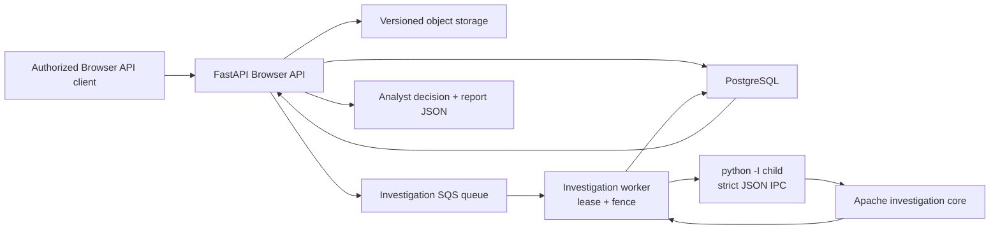

# Video-investigation foundation

> **Implemented boundary:** this document describes the investigation foundation
> present in the default branch after the open-core and local-backend milestones.
> Its executable end-to-end proof uses deterministic fixtures with no model
> inference and no public-web request. The investigation workspace, live local
> multimodal runtime, persisted replay, retrieval, geometric verification,
> damage/change analysis and benchmark results are not implemented capabilities in
> this revision.

InstaDescribe models video investigation as a workflow parallel to audio
description. It reuses tenant identity, direct versioned media transfer, durable
jobs and fenced worker execution, but gives investigation its own evidence,
uncertainty and analyst-decision records.

## Implemented system boundary



FastAPI is the external authorization and control plane. PostgreSQL is the durable
state authority; object storage owns version-pinned source bytes; the investigation
queue transports at-least-once work; and a worker may publish only while it owns the
current database fence. The isolated child proposes a bounded result, which the
parent validates against parent-owned source, identity, policy, candidates, model
provenance and belief configuration before persistence.

There is no investigation page in the current Next.js application. The implemented
product surface is the authenticated Browser API plus its deterministic acceptance
test.

## Workflow and lifecycle

`Job.workflow_kind` distinguishes the two domains:

- `audio_description` is the retained default and legacy workflow;
- `video_investigation` owns the new investigation aggregate.

The investigation lifecycle is:

```text
awaiting_upload -> queued -> preprocessing -> investigating
-> needs_review -> completed
                 \-> failed / cancelled
```

Investigation jobs are deliberately absent from the stable Integration API and
from the MIT SDK/CLI. The Browser API exposes the explicit investigation stages.
Unsupported creation combinations fail before persistence or queue publication.
The only executable creation mode is:

```text
kind: geolocateProvenance
connectivityPolicy: local
```

`damageChange`, `textOnly`, `approvedCrops` and `connected` exist as reserved domain
values, not available pipelines. Requests for them return
`422 investigation_mode_unavailable`.

## Durable domain

| Record | Implemented responsibility |
|---|---|
| `Investigation` | Kind, connectivity policy, internal status, trace ID, model/runtime provenance, final hypothesis or abstention and an intentionally empty calibrated-confidence field |
| `SourceRecord` | Publisher URL and publication time when supplied, collection time, legal basis, license, media SHA-256 after worker validation, redistribution policy and retention metadata |
| `EvidenceItem` | Observation, evidence kind, frame time, optional normalized bounding box, support polarity, reliability, verification state and correlation group |
| `InvestigationStep` | Ordered tool event, evidence inputs/outputs, digests, latency/memory/cost fields, policy decision and entropy before/after |
| `BeliefSnapshot` | Ordered candidates, normalized probabilities, entropy and abstention state |
| `AnalystDecision` | A final accept/reject disposition for every current evidence item, a candidate or explicit abstention, notes and deciding principal |

Every record is organization-scoped. Composite foreign keys and tenant-qualified
repository queries prevent an investigation record from being attached to another
organization's Job. Foreign and missing identifiers share the same absence
boundary.

## Browser API

The implemented Browser routes are:

| Method and path | Purpose |
|---|---|
| `GET /api/app/v1/investigations` | List up to 100 tenant-visible investigations |
| `POST /api/app/v1/investigations` | Create a local geolocation/provenance investigation and receive a constrained direct-upload contract |
| `GET /api/app/v1/investigations/{id}` | Read investigation state and runtime/model provenance |
| `POST /api/app/v1/investigations/{id}/cancel` | Idempotently cancel a non-terminal investigation |
| `GET /api/app/v1/investigations/{id}/steps` | Read the ordered objective tool ledger |
| `GET /api/app/v1/investigations/{id}/evidence` | Read proposed evidence |
| `GET /api/app/v1/investigations/{id}/keyframes` | Read chronological keyframe evidence metadata |
| `GET /api/app/v1/investigations/{id}/beliefs` | Read belief snapshots |
| `POST /api/app/v1/investigations/{id}/decision` | Finalize every evidence disposition and hypothesis or abstention |
| `GET /api/app/v1/investigations/{id}/report` | Read source lineage, evidence, latest belief and final decision when present |

The existing Browser job-upload completion route accepts and version-pins the
source, mirrors the investigation to `queued`, and publishes to the investigation
queue. Retryable writes require bounded idempotency keys. Reads are private and
non-cacheable.

The keyframe endpoint currently returns evidence metadata—timecode, observation and
optional bounding box. It does not expose a stored investigation-frame image or an
investigation workspace.

## Source and media boundary

Creation records the analyst-declared legal and retention context before upload.
Media bytes move directly to versioned object storage under a constrained upload
contract. Upload completion pins an exact object version. The worker then:

1. downloads that pinned source into a per-job workspace;
2. computes the authoritative SHA-256;
3. validates the measured duration against the 30-second to 3-minute investigation
   bound;
4. reconciles quota using the measured duration;
5. binds the immutable digest and source record into the child expectation.

The declared retention tier is 1–30 days. It is a lifecycle/janitor eligibility
contract, not a guarantee that physical deletion occurs at an exact instant.

## Isolated worker boundary

Investigation tasks use a queue distinct from audio-description analysis and render
tasks. The worker inherits the existing lease, heartbeat, reclaim, retry and
cancellation controls. A stale worker cannot publish evidence after ownership is
lost.

The current executable runtime is an explicitly enabled test fixture. It runs in a
separate process with:

- Python isolated mode (`python -I`);
- a minimal explicit environment and private HOME/cache/temp directories;
- request and result files created with owner-only permissions;
- bounded runtime settings, response size and subprocess time;
- canonical JSON rather than `pickle`;
- a workspace-root-scoped host-local file lease that serializes heavyweight
  investigation execution for workers sharing that root;
- parent-side validation and posterior recomputation before database publication.

Loopback Ollama adapter code is present and unit-tested at its internal boundary,
but the production execution function rejects non-fixture operation before child
launch. A live model cannot run end to end until candidate and model-provenance
proposals become validated parent inputs. This fail-closed gap is intentional and
must not be described as a working Qwen demo.

## Evidence and belief contract

The Apache package combines candidate priors and evidence by correlation group:

$$
z_h = \log \pi_h + \sum_g w_g s_g(h)
$$

$$
p(h \mid E) = \mathrm{softmax}(z_h / T)
$$

Within a group, the baseline avoids treating multiple readings of one physical clue
as independent evidence. It records both supporting and contradicting contributions,
then calculates Shannon entropy and deterministic abstention conditions. The strict
IPC decoder independently recomputes the posterior and rejects inconsistent
probabilities, entropy, evidence references or final hypotheses.

The current temperature and posterior are transparent baseline values; they have
not been fitted and validated as calibrated confidence. The database and Browser
response therefore keep `calibratedConfidence` null.

Evidence remains `proposed` in both deterministic acceptance scenarios. An analyst
accepting an observation for a report does not turn it into independently verified
provenance.

## Deterministic acceptance proof

The acceptance test runs two parameterized journeys:

- **supportive:** independent fixture evidence produces a non-abstaining belief,
  then the analyst accepts the evidence and selects the current top candidate;
- **abstention:** insufficient fixture evidence requires the analyst to reject the
  evidence and record an abstention reason.

Both journeys cross:

```text
Browser create
-> direct versioned upload
-> upload completion
-> dedicated queue
-> real worker claim
-> isolated fixture child
-> strict result validation
-> durable evidence / steps / belief
-> analyst decision
-> report
```

The test also checks that the audio-description queue remains empty, the source hash
and object version are pinned, probabilities normalize, fixture provenance is
explicit, every evidence item remains proposed, and the final state is durable.

See
[`services/worker/tests/test_investigation_e2e_acceptance.py`](../services/worker/tests/test_investigation_e2e_acceptance.py)
for the executable specification and
[`packages/investigation-core/README.md`](../packages/investigation-core/README.md)
for the standalone offline baseline.

## Current non-capabilities

This foundation does not claim:

- an analyst-facing investigation workspace or report page;
- a validated live Qwen, OCR or investigation-ASR pipeline;
- source-frame image serving in the Browser contract;
- persisted deterministic replay;
- public-web search, approved crop egress, SIFT/RANSAC or any other geometric
  verification;
- recording-time estimation, damage/change analysis or event clustering;
- benchmarked accuracy, calibration, recall, latency or memory;
- a deployed investigation service or production readiness.

## License boundary

`packages/investigation-core/**` is Apache-2.0 and can run without importing the
BUSL application. The API, persistence, workers, product shell and orchestration are
BUSL-1.1. The existing SDK and CLI remain MIT and investigation-free. See
[`LICENSING.md`](../LICENSING.md) for the controlling file-level map.
