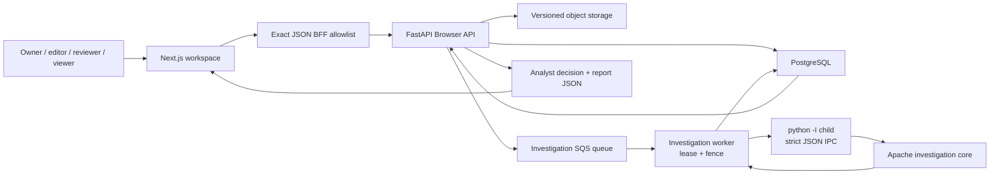

# Video-investigation foundation

> **Implemented boundary:** this document describes the investigation foundation
> present in the default branch after the open-core and local-backend milestones.
> Its executable end-to-end proof uses deterministic fixtures with no model
> inference and no public-web request. An authenticated Next.js analyst workspace
> now presents this boundary through deterministic desktop/mobile browser coverage.
> Live local multimodal runtime, persisted replay, retrieval, geometric
> verification, damage/change analysis and benchmark results are not implemented
> capabilities in this revision.

InstaDescribe models video investigation as a workflow parallel to audio
description. It reuses tenant identity, direct versioned media transfer, durable
jobs and fenced worker execution, but gives investigation its own evidence,
uncertainty and analyst-decision records.

## Implemented system boundary



FastAPI is the external authorization and control plane. PostgreSQL is the durable
state authority; object storage owns version-pinned source bytes; the investigation
queue transports at-least-once work; and a worker may publish only while it owns the
current database fence. The isolated child proposes a bounded result, which the
parent validates against parent-owned source, identity, policy, candidates, model
provenance and belief configuration before persistence.

The implemented product surface is the authenticated Browser API plus Next.js list,
create, workspace and report routes. FastAPI remains the state and authorization
authority; the workspace is a strict projection, not a second domain implementation.

## Workflow and lifecycle

`Job.workflow_kind` distinguishes the two domains:

- `audio_description` is the retained default and legacy workflow;
- `video_investigation` owns the new investigation aggregate.

The investigation lifecycle is:

```text
awaiting_upload -> queued -> preprocessing -> investigating
-> needs_review -> completed
                 \-> failed / cancelled
```

Investigation jobs are deliberately absent from the stable Integration API and
from the MIT SDK/CLI. The Browser API exposes the explicit investigation stages.
Unsupported creation combinations fail before persistence or queue publication.
The only executable creation mode is:

```text
kind: geolocateProvenance
connectivityPolicy: local
```

`damageChange`, `textOnly`, `approvedCrops` and `connected` exist as reserved domain
values, not available pipelines. Requests for them return
`422 investigation_mode_unavailable`.

## Durable domain

| Record | Implemented responsibility |
|---|---|
| `Investigation` | Kind, connectivity policy, internal status, trace ID, model/runtime provenance, final hypothesis or abstention and an intentionally empty calibrated-confidence field |
| `SourceRecord` | Publisher URL and publication time when supplied, collection time, legal basis, license, media SHA-256 after worker validation, redistribution policy and retention metadata |
| `EvidenceItem` | Observation, evidence kind, frame time, optional normalized bounding box, support polarity, reliability, verification state and correlation group |
| `InvestigationStep` | Ordered tool event, evidence inputs/outputs, digests, latency/memory/cost fields, policy decision and entropy before/after |
| `BeliefSnapshot` | Ordered candidates, normalized probabilities, entropy and abstention state |
| `AnalystDecision` | A final accept/reject disposition for every current evidence item, a candidate or explicit abstention, notes and deciding principal |

Every record is organization-scoped. Composite foreign keys and tenant-qualified
repository queries prevent an investigation record from being attached to another
organization's Job. Foreign and missing identifiers share the same absence
boundary.

## Browser API

The implemented Browser routes are:

| Method and path | Purpose |
|---|---|
| `GET /api/app/v1/investigations` | List up to 100 tenant-visible investigations |
| `POST /api/app/v1/investigations` | Create a local geolocation/provenance investigation and receive a constrained direct-upload contract |
| `GET /api/app/v1/investigations/{id}` | Read investigation state and runtime/model provenance |
| `POST /api/app/v1/investigations/{id}/cancel` | Idempotently cancel a non-terminal investigation |
| `GET /api/app/v1/investigations/{id}/steps` | Read the ordered objective tool ledger |
| `GET /api/app/v1/investigations/{id}/evidence` | Read proposed evidence |
| `GET /api/app/v1/investigations/{id}/keyframes` | Read chronological keyframe evidence metadata |
| `GET /api/app/v1/investigations/{id}/beliefs` | Read belief snapshots |
| `POST /api/app/v1/investigations/{id}/decision` | Finalize every evidence disposition and hypothesis or abstention |
| `GET /api/app/v1/investigations/{id}/report` | Read source lineage, evidence, latest belief and final decision when present |

The existing Browser job-upload completion route accepts and version-pins the
source, mirrors the investigation to `queued`, and publishes to the investigation
queue. Retryable writes require bounded idempotency keys. Reads are private and
non-cacheable.

The keyframe endpoint currently returns evidence metadata—timecode, observation and
optional bounding box. It does not expose a stored investigation-frame image or an
image-serving contract.

## Analyst workspace and BFF boundary

The Next.js App Router now exposes:

| Route | Implemented responsibility |
|---|---|
| `/investigations` | Tenant list, status/abstention summary and role-aware create affordance |
| `/investigations/new` | Rights/retention metadata, fixed local mode and direct source upload |
| `/investigations/{uuid}` | Keyframe metadata, evidence state, uncalibrated belief/entropy, objective step ledger and analyst controls |
| `/investigations/{uuid}/report` | Source lineage, evidence dispositions, final hypothesis or explicit abstention |
| `/legacy/audio-description` | Retained audio-description project entry outside primary navigation |

The same-origin BFF admits exactly ten investigation method/path pairs: `GET` and
`POST` on the collection; `GET` detail, steps, keyframes, evidence, beliefs and
report; and `POST` cancel and decision. Wrong methods, malformed identifiers,
arbitrary nested paths and egress proposals return `404` before upstream access.
The stable Integration API, SDK and CLI remain investigation-free.

The browser client parses every investigation projection as an exact bounded shape.
Unknown keys, invalid timestamps/UUIDs, invalid normalized boxes, non-finite values,
non-normalized candidate probabilities and inconsistent abstention/final-hypothesis
states fail closed. Role presentation mirrors the server contract: Owner/Editor may
create or cancel; Owner/Reviewer may decide evidence and finalize; Viewer remains
read-only. FastAPI independently enforces those permissions.

The Browser evidence schema deliberately publishes a bounded observation summary
without the worker's internal observation-detail map. The accompanying schema,
service and generated OpenAPI hardening is part of this workspace boundary; it does
not change the stable Integration API, SDK or CLI.

The workspace deliberately labels the current surface as `Keyframe metadata` and
states that no source pixels are returned. It distinguishes `Proposed observation`
from `Verified by tool`, labels the posterior uncalibrated, exposes entropy and
abstention, and presents recorded tool events rather than hidden model reasoning.
Nonterminal workspaces poll on a bounded schedule. If the latest machine belief
abstained, the analyst form disables candidate selection and requires finalization
to preserve abstention; this is enforced again by FastAPI.

## Source and media boundary

Creation records the analyst-declared legal and retention context before upload.
Media bytes move directly to versioned object storage under a constrained upload
contract. Upload completion pins an exact object version. The worker then:

1. downloads that pinned source into a per-job workspace;
2. computes the authoritative SHA-256;
3. validates the measured duration against the 30-second to 3-minute investigation
   bound;
4. reconciles quota using the measured duration;
5. binds the immutable digest and source record into the child expectation.

The declared retention tier is 1–30 days. It is a lifecycle/janitor eligibility
contract, not a guarantee that physical deletion occurs at an exact instant.

## Isolated worker boundary

Investigation tasks use a queue distinct from audio-description analysis and render
tasks. The worker inherits the existing lease, heartbeat, reclaim, retry and
cancellation controls. A stale worker cannot publish evidence after ownership is
lost.

The current executable runtime is an explicitly enabled test fixture. It runs in a
separate process with:

- Python isolated mode (`python -I`);
- a minimal explicit environment and private HOME/cache/temp directories;
- request and result files created with owner-only permissions;
- bounded runtime settings, response size and subprocess time;
- canonical JSON rather than `pickle`;
- a workspace-root-scoped host-local file lease that serializes heavyweight
  investigation execution for workers sharing that root;
- parent-side validation and posterior recomputation before database publication.

Loopback Ollama adapter code is present and unit-tested at its internal boundary,
but the production execution function rejects non-fixture operation before child
launch. A live model cannot run end to end until candidate and model-provenance
proposals become validated parent inputs. This fail-closed gap is intentional and
must not be described as a working Qwen demo.

### Optional semantic keyframe embeddings

The live extraction path can attach a CLIP-vision embedding to every candidate
frame before the Apache selector runs, so semantically redundant frames (same
landmark, different pixels) are down-ranked or rejected in addition to the pHash
near-duplicate gate. The provider lives in the worker
(`instadescribe_worker/frame_embeddings.py`); the Apache core only ever sees a
vector on `FrameDescriptor.embedding` and stays model-agnostic.

| Setting | Default | Meaning |
|---|---|---|
| `INSTADESCRIBE_INVESTIGATION_SEMANTIC_KEYFRAMES` | `false` | Enable embedding inference and semantic selection |
| `INSTADESCRIBE_INVESTIGATION_SEMANTIC_NOVELTY_WEIGHT` | `0.3` | Soft ranking weight of `semantic_novelty` in the explicit score |
| `INSTADESCRIBE_INVESTIGATION_SEMANTIC_SIMILARITY_THRESHOLD` | unset | Hard gate: cosine at or above it rejects the frame as `semanticDuplicate` |
| `INSTADESCRIBE_FRAME_EMBEDDING_MODEL_PATH` | unset | Absolute path of a local CLIP vision ONNX export (required when enabled) |

Disabled is the default and performs no inference and no model load; keyframe
results are unchanged. Enabling without a model path, or with neither the weight
nor the threshold active, fails settings validation instead of degrading to
pHash-only selection. The model is loaded lazily on the first frame, every
candidate is embedded exactly once, and the selector reuses the stored vector for
all comparisons. Embeddings are raw model outputs (not unit-normalized); cosine
similarity divides by both norms. The model file is not baked into the worker
image yet; fetch the `Xenova/clip-vit-base-patch32` export
(`onnx/vision_model.onnx`, 512-d) with `huggingface-cli download` and point the
path setting at it. `services/worker/scripts/keyframe_semantic_eval.py` compares
baseline and semantic selection on one local video and reports the selected-set
semantic redundancy.

#### Frame analysis manifest

`services/worker/scripts/frame_analysis_demo.py` exports a per-frame manifest for
one local video, so frame-level behaviour can be inspected without a database, a
queue or a second analysis pass. Every value comes from the real path: the worker
frame extractor, one CLIP embedding per candidate, and the open selector. Each
frame carries its scalar quality features, the selector's outcome (selected,
rank, information score, or the rejection reason) and four vector metrics:

| Metric | Meaning |
|---|---|
| `clipCentroidSimilarity` | Cosine to the unit-length mean of the normalized frame embeddings; how typical the frame is of the video |
| `previousFrameSimilarity` | Cosine to the preceding frame in time order; null for the first frame |
| `nearestSelectedSimilarity` | Highest cosine to any keyframe in the final selected set, excluding the frame itself |
| `semanticNovelty` | The selector's novelty term, `1 - nearestSelectedSimilarity` clamped to `[0, 1]` |

All four are cosine similarities in `[-1, 1]` — direction comparisons, not
confidences, probabilities or quality judgements, and the manifest states that
in its own `metricDefinitions` block so a viewer cannot relabel them. The
selector's as-of-selection readings are carried separately under `keyframe`,
because those, not the final-set values, are what produced `informationScore`.
Raw embedding vectors are never written out; the manifest holds scalars only.
Output is derived from local media and is git-ignored rather than committed.

### Visual candidate retrieval (library and benchmark only)

The Apache core now includes exact in-memory retrieval
(`InMemoryVisualCandidateRetriever`): a query embedding is scored against every
`VisualCandidate` with the same cosine primitive, and the top-K signed cosines are
returned as `VisualRetrievalCandidate` values. It is not wired into the worker
execution path and has no production settings; it answers "which images might
match?" and its output is not evidence. Geometric verification (below) consumes
these candidates. `services/worker/scripts/visual_retrieval_eval.py`
builds a small corpus from the CC BY Sintel clip (neighbour frames and augmented
copies as relevant candidates, synthetic distractors), embeds each image once with
the CLIP provider, and reports top-1, hit rate, recall, MRR, nDCG, the
positive/distractor cosine margin, embedding inference time and exact-search
retrieval time separately.

### Geometric verification (library and benchmark only)

Retrieved candidates are verified locally by
`instadescribe_worker.visual_verification.SiftRansacVisualMatcher` (OpenCV SIFT
descriptors, brute-force KNN matching with Lowe's ratio test, RANSAC homography
`p' ~ H p`). The Apache core owns the seam: the `VisualMatcher` protocol takes
two image paths plus the retrieval cosine and returns a `VisualMatch`
(`feature_matches` = ratio-test survivors, `ransac_inliers`, mean inlier
reprojection error, `verified`, and a named `rejection_reason` such as
`insufficientFeatures` when unverified); `verify_retrieval_candidates` bridges
Top-K retrieval output to the matcher without either side knowing the other's
internals. The decision rule is explicit — good matches, RANSAC inliers and
inlier ratio must all clear configured minimums (`VerificationConfig`) — and the
retrieval cosine can never flip `verified`; it is provenance only. Infrastructure
failures (missing/undecodable images) raise `JobFailure` rather than returning
`verified=False`, and no combined "confidence" is synthesized from the separate
signals. Like retrieval, verification is not wired into worker execution and
produces no evidence or belief updates; `VisualMatch` is where this stage stops.
`services/worker/scripts/visual_verification_eval.py` benchmarks it on the
Sintel corpus (neighbour frames plus crop/scale/rotation/brightness/perspective/
occlusion transforms as positives; cross-scene frames and synthetic images as
negatives) and reports TP/FP/TN/FN, precision/recall/F1, positive-vs-negative
signal separation, per-stage latency and a minimum-inlier sensitivity sweep.
Verification runs offline: OpenCV never touches the network, and the core never
imports OpenCV.

### Visual-match evidence (library only, disabled by default)

`visual_match_to_evidence` interprets a **verified** `VisualMatch` as one
`EvidenceItem` of kind `visualMatch` and stops there; belief fusion is the
existing `update_beliefs` path, unchanged. The rules are deliberate:
`verified=True` becomes a single fixed `+1.0` contribution at reliability 1.0
(verification decides whether evidence *exists*, not how strong it is — the raw
cosine, match count, inlier count, ratio and reprojection error ride along as
`attributes` diagnostics and never enter the score); `verified=False` produces
**no** evidence, never negative evidence, because a failed RANSAC means
"correspondence was not established", not "the hypothesis is false"; and a
retrieval hit alone is never evidence. The hypothesis is supplied by an explicit
`VisualCandidateBinding(candidate_id, hypothesis_id, source_observation_id)` —
retrieval ids and belief-candidate ids are separate identifier spaces, and no
hypothesis is ever inferred from a candidate id, filename or rank.

Correlation reuses `belief._group_scores` (strongest signed contribution per
group), with the group keyed on the *observation* —
`visual:<query_observation_id>:<source_observation_id>` — not the claim, matching
how frame-derived evidence is grouped. Transformed variants of one reference
capture therefore share a group and collapse to a single contribution, while a
different query shot against a different capture contributes independently.
Evidence identity is `visual-match-<sha256 of the semantic inputs>`, so replaying
a match cannot double-count it. `VisualEvidenceConfig.enabled` is **False** by
default: matches and their diagnostics are still produced, but nothing reaches
`update_beliefs` until the feature is switched on.

Persistence: migration `0015_visual_match_evidence_kind` adds `visualMatch` to
the `evidence_items.kind` allowlist alongside the existing kinds, so a converted
match can be stored. `visual` keeps its meaning — a visual observation of a
frame — while `visualMatch` records a verified correspondence between a query
frame and a reference candidate. Widening the allowlist changes storage only:
the adapter stays disabled by default, and nothing yet writes these rows on the
worker execution path.

**Embedding model artifact provenance.** The provider runs
`Xenova/clip-vit-base-patch32`, revision `d15189d7028b43f1d3e65039190477f6af591c2a`,
file `onnx/vision_model.onnx` (sha256
`fd6e1402a588279d1723c7534d4bcba5bc0b14b47dfab0e46f8c47b8270d7d40`, fp32, 352 MB),
an ONNX export of `openai/clip-vit-base-patch32` made for Transformers.js. Neither
Hub repository carries a license tag on its model card; OpenAI's CLIP source
repository is MIT-licensed. The export's license and provenance are therefore
**not yet resolved for production use**: the artifact is suitable for local
development and evaluation, and must not be baked into the worker image until the
maintainer has confirmed acceptable licensing for the exact file digest above.

## Evidence and belief contract

The Apache package combines candidate priors and evidence by correlation group:

$$
z_h = \log \pi_h + \sum_g w_g s_g(h)
$$

$$
p(h \mid E) = \mathrm{softmax}(z_h / T)
$$

Within a group, the baseline avoids treating multiple readings of one physical clue
as independent evidence. It records both supporting and contradicting contributions,
then calculates Shannon entropy and deterministic abstention conditions. The strict
IPC decoder independently recomputes the posterior and rejects inconsistent
probabilities, entropy, evidence references or final hypotheses.

The current temperature and posterior are transparent baseline values; they have
not been fitted and validated as calibrated confidence. The database and Browser
response therefore keep `calibratedConfidence` null.

Evidence remains `proposed` in both deterministic acceptance scenarios. An analyst
accepting an observation for a report does not turn it into independently verified
provenance.

## Deterministic acceptance proof

The acceptance test runs two parameterized journeys:

- **supportive:** independent fixture evidence produces a non-abstaining belief,
  then the analyst accepts the evidence and selects the current top candidate;
- **abstention:** insufficient fixture evidence requires the analyst to reject the
  evidence and record an abstention reason.

Both journeys cross:

```text
Browser create
-> direct versioned upload
-> upload completion
-> dedicated queue
-> real worker claim
-> isolated fixture child
-> strict result validation
-> durable evidence / steps / belief
-> analyst decision
-> report
```

The test also checks that the audio-description queue remains empty, the source hash
and object version are pinned, probabilities normalize, fixture provenance is
explicit, every evidence item remains proposed, and the final state is durable.

See
[`services/worker/tests/test_investigation_e2e_acceptance.py`](../services/worker/tests/test_investigation_e2e_acceptance.py)
for the executable specification and
[`packages/investigation-core/README.md`](../packages/investigation-core/README.md)
for the standalone offline baseline.

A separate Playwright fixture exercises the user-facing projection on desktop and
mobile Chromium. It covers bounded deep links, list/create, an intercepted direct
upload, every human role, workspace/report rendering, explicit abstention and the
legacy route. The fixture proves that the browser exposes no retrieval/egress path
and blocks unexpected browser requests; it does not execute or certify worker
network isolation. Authenticated BFF calls and direct private-storage upload remain
explicit transport paths. The backend acceptance fixture separately exercises the
local no-public-web worker path. Its observations, identifiers and account label are
synthetic; `deterministic-fixture` is shown as `Deterministic fixture · no model
inference`.

The browser fixture includes one synthetic `verified` metadata record only to test
the UI's state distinction. It is not output from the worker acceptance fixture,
whose generated evidence remains `proposed`, and it is not a verification-quality
claim. See
[`App/e2e/investigation-workspace.spec.ts`](../App/e2e/investigation-workspace.spec.ts).

## Current non-capabilities

This workspace-backed foundation does not claim:

- a validated live Qwen, OCR or investigation-ASR pipeline;
- source-frame image serving in the Browser contract;
- persisted deterministic replay;
- public-web search or approved crop egress;
- geometric verification wired into worker execution (the SIFT/RANSAC matcher
  and its evidence adapter exist as a library + benchmark; the schema accepts
  the `visualMatch` kind, but the adapter is disabled by default and no
  execution path writes these rows);
- calibrated visual-match strength (the +1.0 support is a fixed, uncalibrated
  event weight, not a probability);
- recording-time estimation, damage/change analysis or event clustering;
- benchmarked accuracy, calibration, recall, latency or memory;
- a deployed investigation service or production readiness.

## License boundary

`packages/investigation-core/**` is Apache-2.0 and can run without importing the
BUSL application. The API, persistence, workers, product shell and orchestration are
BUSL-1.1. The existing SDK and CLI remain MIT and investigation-free. See
[`LICENSING.md`](../LICENSING.md) for the controlling file-level map.
